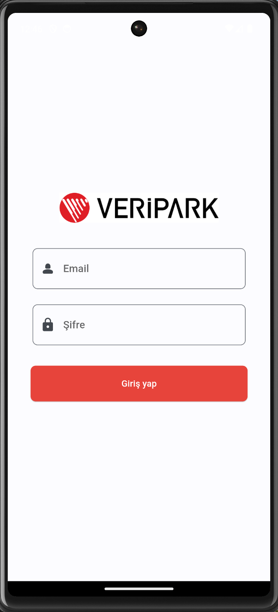
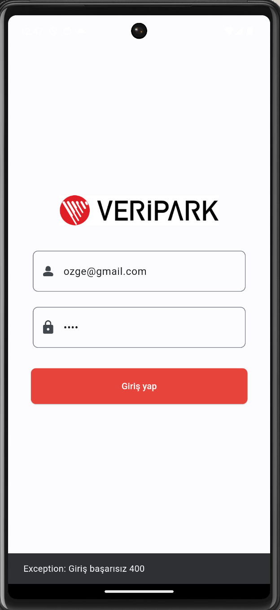
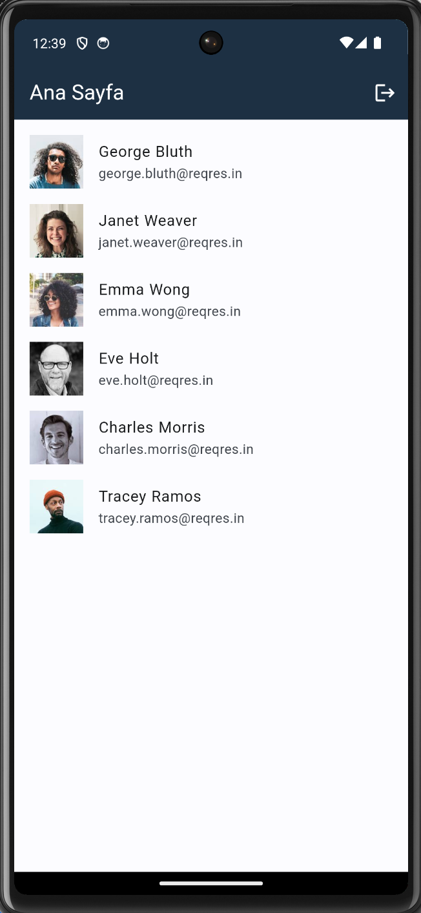

# Flutter Authentication and User List App

Bu proje, Flutter kullanılarak geliştirilmiş, Riverpod durum yönetimi ve MVC mimarisi ile yapılandırılmış bir mobil uygulamadır. Uygulama, kullanıcılara giriş yapma ve kayıtlı kullanıcıların listesini görüntüleme özellikleri sunar.

## Proje Görselleri

## Özellikler

- Kullanıcı girişi
- Kullanıcı listesi görüntüleme
- Riverpod durum yönetimi
- MVC mimarisi

## Proje Yapısı

- `lib/`
- `models/`: Uygulama modelleri.
- `views/`: Uygulama ekranları.
- `controllers/`: Uygulama iş mantığını kontrol eden sınıflar.
- `services/`: Harici servisler ile etkileşim.
- `main.dart`: Uygulamanın giriş noktası.

## Kullanılan Teknolojiler

- [Flutter](https://flutter.dev/)
- [Riverpod](https://riverpod.dev/)
- [Shared Preferences](https://pub.dev/packages/shared_preferences)
- [HTTP](https://pub.dev/packages/http)

